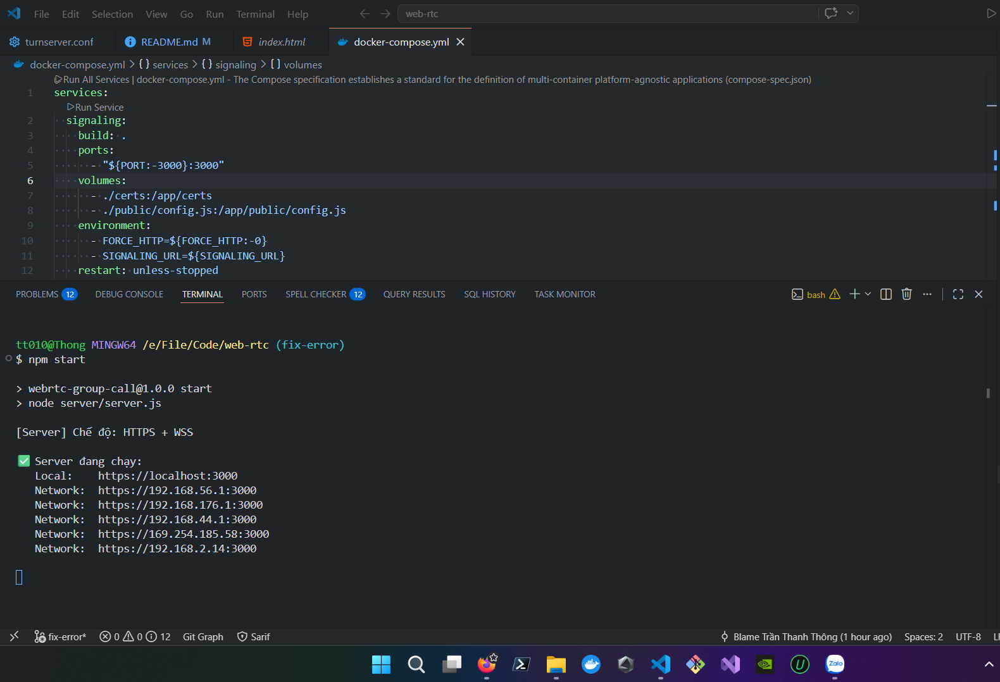
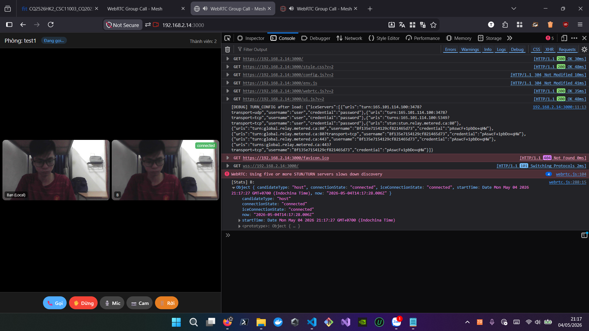
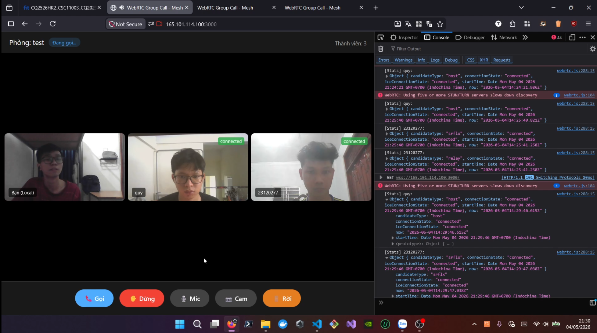

# Báo cáo: Hệ thống WebRTC Group Call (Mesh)

---

## 1. Kiến trúc hệ thống

Hệ thống gồm 3 thành phần chính:

| Thành phần | Vai trò | Công nghệ |
|---|---|---|
| **Signaling Server** | Điều phối kết nối, quản lý phòng | Node.js + Express + `ws` |
| **WebRTC Client** | Gọi video nhóm (mesh) | HTML/JS + `getUserMedia` + `RTCPeerConnection` |
| **TURN Server** | Relay media khi P2P thất bại | coturn (Docker) |

### Kiến trúc Mesh

Mỗi client tạo **n-1 kết nối RTCPeerConnection** đến tất cả thành viên còn lại trong phòng.

Ví dụ với 3 người (A, B, C):

```
        A
       / \
      /   \
     B─────C
```

- A có PC đến B và C
- B có PC đến A và C
- C có PC đến A và B

**Ưu điểm:** đơn giản, không cần server media.  
**Nhược điểm:** băng thông tăng O(n), mỗi client upload n-1 stream.

### Luồng hoạt động

```
1. Client mở WebSocket → register → joinRoom
2. Server broadcast roomMembers đến tất cả
3. Client nhấn "Gọi" → tạo PC cho từng peer
4. Trao đổi offer/answer/candidate qua signaling server
5. ICE negotiation hoàn tất → P2P hoặc TURN relay
6. Stream xuất hiện → UI cập nhật video grid
```

---

## 2. Giao thức Signaling

Các message JSON được định nghĩa như sau:

### Client gửi lên Server

```json
// Đăng ký nickname ngay sau khi mở WebSocket
{ "type": "register", "name": "A" }

// Tạo hoặc tham gia phòng
{ "type": "joinRoom", "roomId": "group1", "name": "A" }

// Thương lượng WebRTC
{ "type": "offer",     "roomId": "group1", "sender": "A", "target": "B", "offer": { "sdp": "...", "type": "offer" } }
{ "type": "answer",    "roomId": "group1", "sender": "B", "target": "A", "answer": { "sdp": "...", "type": "answer" } }
{ "type": "candidate", "roomId": "group1", "sender": "A", "target": "B", "candidate": { "candidate": "...", "sdpMid": "0" } }

// Kết thúc cuộc gọi (ở lại phòng)
{ "type": "endCall", "roomId": "group1", "sender": "A" }

// Rời phòng hoàn toàn
{ "type": "leaveRoom", "roomId": "group1", "sender": "A" }
```

### Server broadcast xuống Client

```json
// Cập nhật danh sách thành viên
{ "type": "roomMembers", "roomId": "group1", "members": ["A", "B"] }

// Thông báo thành viên rời phòng
{ "type": "memberLeft", "roomId": "group1", "name": "B" }
```

### Tóm tắt message types

| Message | Chiều | Mô tả |
|---|---|---|
| `register` | Client → Server | Đăng ký nickname |
| `joinRoom` | Client → Server | Tạo / tham gia phòng |
| `offer` | Client → Server → Client | SDP offer |
| `answer` | Client → Server → Client | SDP answer |
| `candidate` | Client → Server → Client | ICE candidate |
| `endCall` | Client → Server → Client | Kết thúc cuộc gọi (ở lại phòng) |
| `leaveRoom` | Client → Server | Rời phòng |
| `roomMembers` | Server → Client | Danh sách thành viên |
| `memberLeft` | Server → Client | Thông báo thành viên rời |

---

## 3. Thiết kế Room & Group Call

### Room Management

Server quản lý state bằng 2 Map:

```js
const clients = new Map(); // Key: ws object | Value: { name }
const rooms   = new Map(); // Key: roomId    | Value: Map<name, ws>
```

- Khi client `joinRoom`, server thêm vào `rooms.get(roomId)` và broadcast `roomMembers`.
- Khi client `leaveRoom` hoặc disconnect, server xóa khỏi phòng, gửi `memberLeft`, rồi broadcast `roomMembers` mới.

### Mesh Group Call

Khi nhấn **Start Group Call**, client:
1. Lọc `roomMembers` (trừ bản thân).
2. Với mỗi thành viên, tạo `RTCPeerConnection` mới.
3. `addTrack` local stream vào PC.
4. `createOffer` → `setLocalDescription` → gửi `offer` qua signaling.

**Tie-breaker:** Nếu cả hai cùng bấm "Gọi" đồng thời, quy tắc so sánh tên (`currentUserName < sender`) quyết định ai giữ offer.

### Grid Video

Dùng CSS Grid tự động điều chỉnh:

```css
#video-grid {
  display: grid;
  grid-template-columns: repeat(auto-fit, minmax(300px, 1fr));
  gap: 8px;
}
```

Mỗi peer có `id="wrapper-{remoteName}"` để dễ xóa khi rời.

---

## 4. Triển khai TURN

### Cấu hình

Sử dụng **coturn** qua Docker Compose (`docker-compose.yml`, profile `turn`).

File `turnserver.conf`:

```
listening-port=3478
tls-listening-port=5349
external-ip=165.101.114.100
relay-ip=165.101.114.100
user=user:password
realm=webrtc.local
verbose
no-cli
```

Client cấu hình ICE servers trong `public/config.js`:

```js
iceServers: [
  { urls: "turn:165.101.114.100:3478?transport=udp", username: "user", credential: "password" },
  { urls: "turn:165.101.114.100:3478?transport=tcp", username: "user", credential: "password" },
  { urls: "turns:165.101.114.100:5349?transport=tcp", username: "user", credential: "password" }
]
```

### Fallback tự động

Nếu ICE chưa `connected` sau 20 giây, UI hiển thị "Đang kết nối..." và tiếp tục thương lượng qua TURN. Nếu `failed`, tự động gọi `pc.restartIce()`.

---

## 5. Kết quả kiểm thử

### 5.1 Test cùng LAN (P2P)

**Cấu hình:** 2 tab trình duyệt trên cùng WiFi.

| Bước | Thao tác | Kết quả |
|---|---|---|
| 1 | Chạy server: `npm start` | Server in ra `https://192.168.2.14:3000/` |
| 2 | Máy A mở URL trên Chrome | Camera hoạt động, nhập tên "A" |
| 3 | Máy B mở URL trên Chrome | Camera hoạt động, nhập tên "B" |
| 4 | Cả hai nhập mã phòng "test1" | Thấy thành viên: 2 |
| 5 | A nhấn **📞 Gọi** | Status B chuyển `Sẵn sàng` → `Đang kết nối...` → `Đã kết nối` |
| 6 | Video B xuất hiện trên màn hình A | Grid hiển thị 2 video |

**Log console (Máy A):**

```
[Stats] B: {
  "candidateType": "host",
  "connectionState": "connected",
  "iceConnectionState": "connected",
  "startTime": "2026-05-04T14:17:27.918Z",
  "now": "2026-05-04T14:17:28.006Z"
}
```






> **Nhận xét:** Trong cùng LAN, ICE chọn candidate type `host` (kết nối trực tiếp). Không cần TURN. Thời gian kết nối < 2 giây.

### 5.2 Test gọi nhóm 3 người (cùng LAN)

**Cấu hình:** hoàn toàn tương tự như test với hai người nhưng với 3 tab trình duyệt trên cùng máy.

| Bước | Kết quả |
|---|---|
| Vào phòng "test2" với A, B, C | Thành viên: 3 |
| A nhấn **📞 Gọi** | A tạo 2 PC → B và C |
| B thấy video A, C và A thấy video B, C | Cả 3 video hiển thị trong grid |
| C rời phòng | B và A thấy tile C biến mất, thành viên: 2 |

### 5.3 Test khác mạng / 4G (TURN relay)

**Cấu hình:** 2 máy Laptop A, B (WiFi Ký túc xá) + 1 Laptop C khác mạng. Signaling server public qua VPS.

| Bước | Kết quả |
|---|---|
| Mở URL VPS các Laptop | Camera hoạt động |
| Cả ba vào cùng phòng | Thấy thành viên: 3 |
| Nhấn **📞 Gọi** | ICE negotiation bắt đầu |
| Sau vài giây | Status → `Đã kết nối` |

**Kết quả Log từ console của Laptop A:**

Máy B:
```
[Stats] quy: {
  "candidateType": "host",
  "connectionState": "connected",
  "iceConnectionState": "connected",
  "startTime": "2026-05-04T14:24:21.673Z",
  "now": "2026-05-04T14:24:21.986Z"
}
```

Máy C:

```
[Stats] 23120277: {
  "candidateType": "srflx",
  "connectionState": "connected",
  "iceConnectionState": "connected",
  "startTime": "2026-05-04T14:25:40.497Z",
  "now": "2026-05-04T14:25:41.258Z"
}
```

```
[Stats] 23120277: {
  "candidateType": "relay",
  "connectionState": "connected",
  "iceConnectionState": "connected",
  "startTime": "2026-05-04T14:25:40.497Z",
  "now": "2026-05-04T14:25:41.258Z"
}
```

> **Nhận xét:** Khi 2 client ở mạng khác nhau (NAT khác nhau), P2P thất bại. TURN relay trên VPS được sử dụng. Candidate type `relay` xác nhận media đi qua TURN server.

**Một số log của server:**

```bash
signaling-1  | [relay] candidate | thong → quy
signaling-1  | [MSG] type=candidate thong
signaling-1  | [relay] candidate | thong → quy
coturn-1     | 4980: (12): INFO: IPv4. tcp or tls connected to: 14.186.75.156:56316
coturn-1     | 4980: (12): INFO: IPv4. tcp or tls connected to: 14.186.75.156:56328
coturn-1     | 4980: (12): INFO: IPv4. tcp or tls connected to: 14.186.75.156:56340
signaling-1  | [MSG] type=answer quy
signaling-1  | [relay] answer | quy → thong
coturn-1     | 4980: (11): INFO: session 000000000000000131: realm <webrtc.local> user <>: incoming packet message processed, error 401: Unauthorized
signaling-1  | [MSG] type=candidate quy
signaling-1  | [relay] candidate | quy → thong
signaling-1  | [MSG] type=candidate quy
signaling-1  | [relay] candidate | quy → thong
coturn-1     | 4980: (12): INFO: session 001000000000000107: TCP socket closed remotely 14.186.75.156:56340
coturn-1     | 4980: (12): INFO: session 001000000000000107: usage: realm=<webrtc.local>, username=<>, rp=0, rb=0, sp=0, sb=0
coturn-1     | 4980: (12): INFO: session 001000000000000107: peer usage: realm=<webrtc.local>, username=<>, rp=0, rb=0, sp=0, sb=0
coturn-1     | 4980: (12): INFO: session 001000000000000107: closed (2nd stage), user <> realm <webrtc.local> origin <>, local 165.101.114.100:3478, remote 14.186.75.156:56340, reason: TCP connection closed by client (callback)
coturn-1     | 4980: (11): INFO: IPv4. Local relay addr: 165.101.114.100:64512
coturn-1     | 4980: (11): INFO: session 000000000000000131: new, realm=<webrtc.local>, username=<user>, lifetime=600
coturn-1     | 4980: (11): DEBUG: Global turn allocation count incremented, now 10
coturn-1     | 4980: (11): INFO: session 000000000000000131: realm <webrtc.local> user <user>: incoming packet ALLOCATE processed, success
coturn-1     | 4980: (12): INFO: IPv4. tcp or tls connected to: 14.186.75.156:63298
coturn-1     | 4980: (12): INFO: session 001000000000000108: realm <webrtc.local> user <>: incoming packet message processed, error 401: Unauthorized
coturn-1     | 4980: (11): INFO: session 000000000000000132: realm <webrtc.local> user <>: incoming packet message processed, error 401: Unauthorized
signaling-1  | [MSG] type=candidate quy
signaling-1  | [relay] candidate | quy → thong
signaling-1  | [MSG] type=candidate quy
signaling-1  | [relay] candidate | quy → thong
signaling-1  | [MSG] type=candidate quy
signaling-1  | [relay] candidate | quy → thong
coturn-1     | 4980: (11): INFO: session 000000000000000131: peer 192.168.56.1 lifetime updated: 300
coturn-1     | 4980: (11): INFO: session 000000000000000131: realm <webrtc.local> user <user>: incoming packet CREATE_PERMISSION processed, success
coturn-1     | 4980: (11): INFO: session 000000000000000131: peer 192.168.176.1 lifetime updated: 300
coturn-1     | 4980: (11): INFO: session 000000000000000131: realm <webrtc.local> user <user>: incoming packet CREATE_PERMISSION processed, success
coturn-1     | 4980: (11): INFO: session 000000000000000131: peer 192.168.44.1 lifetime updated: 300
coturn-1     | 4980: (11): INFO: session 000000000000000131: realm <webrtc.local> user <user>: incoming packet CREATE_PERMISSION processed, success
coturn-1     | 4980: (11): INFO: session 000000000000000131: peer 192.168.2.14 lifetime updated: 300
coturn-1     | 4980: (11): INFO: session 000000000000000131: realm <webrtc.local> user <user>: incoming packet CREATE_PERMISSION processed, success
coturn-1     | 4980: (11): INFO: IPv4. Local relay addr: 165.101.114.100:59901
coturn-1     | 4980: (11): INFO: session 000000000000000132: new, realm=<webrtc.local>, username=<user>, lifetime=3600
coturn-1     | 4980: (11): DEBUG: Global turn allocation count incremented, now 11
coturn-1     | 4980: (11): INFO: session 000000000000000132: realm <webrtc.local> user <user>: incoming packet ALLOCATE processed, success
coturn-1     | 4980: (12): INFO: IPv4. Local relay addr: 165.101.114.100:59253
coturn-1     | 4980: (12): INFO: session 001000000000000108: new, realm=<webrtc.local>, username=<user>, lifetime=600
coturn-1     | 4980: (12): DEBUG: Global turn allocation count incremented, now 12
coturn-1     | 4980: (12): INFO: session 001000000000000108: realm <webrtc.local> user <user>: incoming packet ALLOCATE processed, success
coturn-1     | 4980: (12): INFO: session 001000000000000108: peer 192.168.56.1 lifetime updated: 300
coturn-1     | 4980: (12): INFO: session 001000000000000108: realm <webrtc.local> user <user>: incoming packet CREATE_PERMISSION processed, success
coturn-1     | 4980: (12): INFO: session 001000000000000108: peer 192.168.176.1 lifetime updated: 300
coturn-1     | 4980: (12): INFO: session 001000000000000108: realm <webrtc.local> user <user>: incoming packet CREATE_PERMISSION processed, success
coturn-1     | 4980: (12): INFO: session 001000000000000108: peer 192.168.44.1 lifetime updated: 300
coturn-1     | 4980: (12): INFO: session 001000000000000108: realm <webrtc.local> user <user>: incoming packet CREATE_PERMISSION processed, success
coturn-1     | 4980: (12): INFO: session 001000000000000108: peer 192.168.2.14 lifetime updated: 300
coturn-1     | 4980: (12): INFO: session 001000000000000108: realm <webrtc.local> user <user>: incoming packet CREATE_PERMISSION processed, success
signaling-1  | [MSG] type=candidate thong
signaling-1  | [relay] candidate | thong → quy
signaling-1  | [MSG] type=candidate thong
signaling-1  | [relay] candidate | thong → quy
signaling-1  | [MSG] type=candidate quy
signaling-1  | [relay] candidate | quy → thong
coturn-1     | 4980: (12): INFO: session 001000000000000108: peer 14.186.75.156 lifetime updated: 300
coturn-1     | 4980: (12): INFO: session 001000000000000108: realm <webrtc.local> user <user>: incoming packet CREATE_PERMISSION processed, success
coturn-1     | 4980: (11): INFO: session 000000000000000131: peer 14.186.75.156 lifetime updated: 300
coturn-1     | 4980: (11): INFO: session 000000000000000131: realm <webrtc.local> user <user>: incoming packet CREATE_PERMISSION processed, success
coturn-1     | 4980: (12): INFO: session 001000000000000108: peer 165.101.114.100 lifetime updated: 300
```




---

## 6. Hạn chế & hướng phát triển

- **Mesh topology:** không scale tốt > 6 người (băng thông tăng O(n²)). Có thể nâng cấp lên **SFU** (Selective Forwarding Unit) như Janus, mediasoup.
- **TURN self-hosted:** tốn tài nguyên VPS. Có thể dùng dịch vụ TURN cloud (Twilio, Xirsys) nếu cần độ tin cậy cao hơn.
- **UI:** chưa có indicator băng thông/mất gói realtime. Có thể thêm WebRTC stats panel.
- **Auth:** hiện tại chỉ dùng nickname, không xác thực. Có thể thêm JWT token.
- **Recording:** chưa hỗ trợ ghi lại cuộc gọi. Có thể dùng MediaRecorder API.
- **Chưa hỗ trợ share màn hình**
